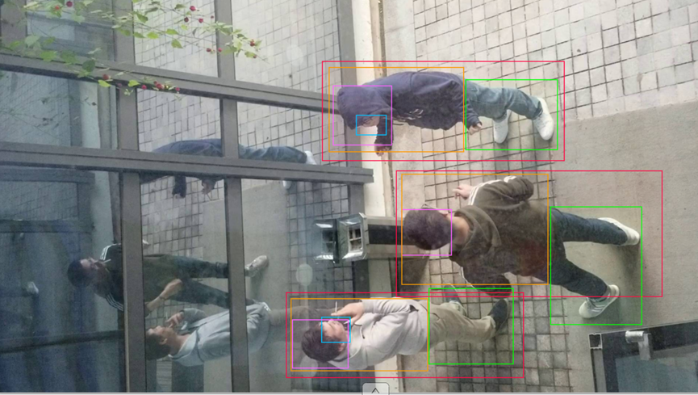

# 视频分析标注用例
##### 整体说明：根据对象类型选取相应标签，用矩形框标注（平面镜中反射的图像无须标注，被大面积覆盖的对象可以部分标注或不标注）。
## 视频分析--人物
### 全部标签

##### 图例

##### 说明：将不同区域按范围选中后用矩形框做标注，镜面成像后的图像（人）不做标注。
#### 人脸
##### 图例

##### 说明：选中“人脸”标签，将人的脸部区域按范围框出，未展露人脸或者人脸绝大部分被遮挡的不做标注。
#### 人头
##### 图例

##### 说明：选中“人头”标签，将人的头部区域按范围框出，头部全部或大部分被遮挡的不做标注，头上有帽子的不影响标注。
#### 上半身
##### 图例

##### 说明：选中“上半身”标签，将人从颈部到腰部区域按范围框出，手臂伸出过长的无须完全覆盖，同样被遮挡过多的可部分标注或不做标注。
#### 下半身
##### 图例

##### 说明：选中“下半身”标签，将人从腰部到脚部区域按范围框出，同样被遮挡过多的可部分标注或不做标注。
#### 全身
##### 图例

##### 说明：选中“全身”标签，将人从头顶部到脚部区域按范围框出，不同人之间标注图框可有重叠，被遮挡过多的可部分标注或不做标注。
## 视频分析--烟
### 全部标签

##### 图例

##### 说明：根据烟所在的位置按标签分类做标注，镜面映射后的影像不做标注。
#### 烟在手
##### 图1

##### 图2

##### 说明：对于拿在手里的单支或多支香烟（包括普通香烟、烟斗、电子烟、雾化烟等），标签设置为“烟在手”（拿在手里的香烟盒除外）。
#### 烟在嘴
##### 图1

##### 图2

##### 说明：对于放置在嘴里的单支或多支香烟（包括普通香烟、烟斗、电子烟、雾化烟等），标签设置为“烟在嘴”。图2所示的情形既可标注为“烟在手”，也可标注为“烟在嘴”，但优先标注为“烟在嘴”。
#### 烟
##### 图1

##### 图2

##### 说明：对于放置在桌面等除手和嘴以外其他位置的香烟（包括单支烟、多支烟、烟屁、烟盒、烟斗、烟嘴等），以及拿在手中的香烟盒，标注为“烟”。
## 视频分析--手机
### 全部标签

##### 图例

##### 说明：根据手机（移动电话，不包括固定电话）所在的位置选择标签，用矩形框框出手机全貌。
#### 手机在手
##### 图例

##### 说明：将拿在手里的手机，选择标签为“手机在手”，用矩形框框出。
#### 手机在头
##### 图例

##### 说明：将接触头部的手机（以贴耳接听电话为例），选择标签为“手机在头”，用矩形框框出。
#### 手机
##### 图例

##### 说明：将放置在桌面等其他位置的手机（移动电话，不包括固定电话），选择“手机”标签，用矩形框框出。
## 视频分析--头盔
### 全部标签

#### 安全帽
##### 图例

##### 说明：将佩戴或放置的安全帽，选择标签“安全帽”，用矩形框框出。
#### 帽子
##### 图1

##### 图2

##### 图3

##### 图4

##### 图5

##### 说明：将头部佩戴的各类帽子、头纱等包裹头部的布制遮盖物识别并选择标签“帽子”，用矩形框框出。
#### 其他头盔
##### 图例

##### 说明：将摩托车头盔等识别为标签“其他头盔”，用矩形框框出。
##### 注：如何区分安全帽与头盔？
从外貌上看，安全帽由帽壳、帽衬、下颌带、后箍等组成，主要保护头顶部，一般针对高空坠物导致的伤害；安全头盔由壳体、缓冲层、舒适衬垫、佩戴装置、护目镜等组成，全方位无死角地对头部的上面、正面、侧面进行保护。
